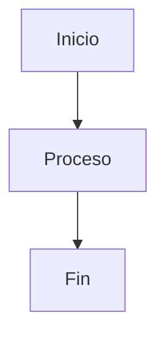
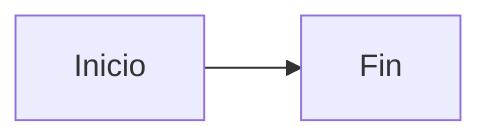
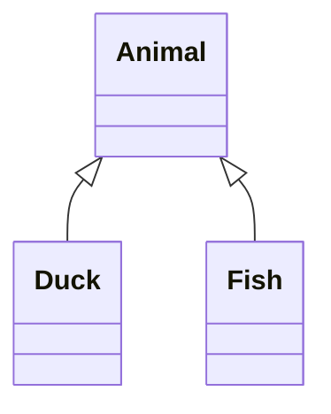
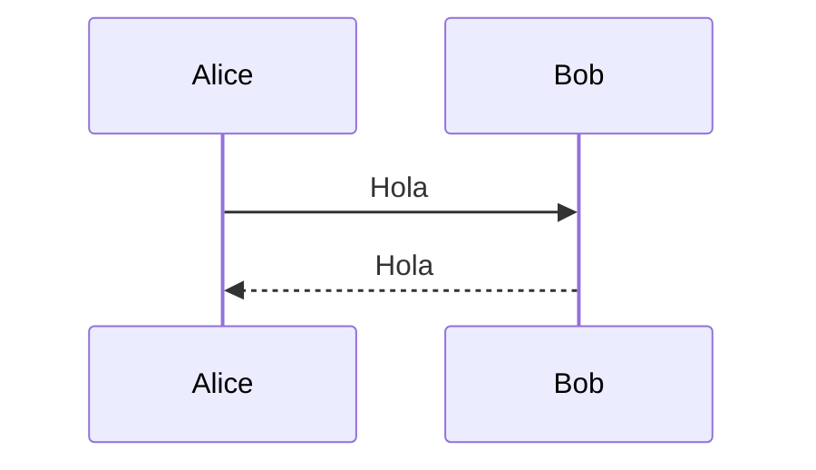
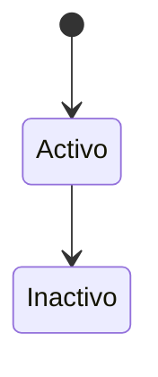

# TURTLE Diagrams

Repositorio de diagramas para el proyecto TURTLE, generados con [Mermaid](https://mermaid.js.org/) y desplegados automaticamente via [GitHub Pages](https://turtle-urp.github.io/TURTLE-DIAGRAMS).

## Estructura del proyecto

```
turtle-diagrams/
├── diagrams/                  # Archivos fuente .mmd
│   ├── arquitecture-diagrams/
│   ├── class-diagrams/
│   ├── EER-diagrams/
│   ├── sequence-diagrams/
│   ├── state-diagrams/
│   └── example.mmd
├── public/
│   ├── svgs/                  # SVGs generados (desplegados en Pages)
│   └── images/                # PNGs generados (alta calidad 4x)
├── scripts/
│   └── build-diagrams.sh      # Script de build
├── puppeteer-config.json      # Config para CI (--no-sandbox)
├── .github/workflows/
│   └── deploy.yml             # Workflow de GitHub Actions
└── package.json
```

## Requisitos previos

- [Node.js](https://nodejs.org/) >= 18
- npm (viene con Node.js)

## Agregar un diagrama

1. Crear un archivo `.mmd` en la carpeta correspondiente dentro de `diagrams/`:

```bash
# Linux / macOS
touch diagrams/arquitecture-diagrams/mi-diagrama.mmd

# Windows (PowerShell)
New-Item -ItemType File -Path "diagrams\arquitecture-diagrams\mi-diagrama.mmd"
```

2. Escribir el diagrama en sintaxis Mermaid:



3. Hacer push a `main`. El workflow lo convertira automaticamente a SVG y PNG.

## Build local

### Linux / macOS

```bash
npm install
bash scripts/build-diagrams.sh
```

### Windows (PowerShell)

```powershell
npm install
bash scripts/build-diagrams.sh
```

> **Nota:** En Windows se puede ejecutar bash directamente si tienes Git Bash instalado (viene incluido con [Git for Windows](https://git-scm.com/download/win)). Tambien puedes usar WSL.

O ejecutar un diagrama individual:

```bash
# SVG
npx mmdc -i diagrams/example.mmd -o public/svgs/example.svg

# PNG (alta calidad, escala 4x)
npx mmdc -i diagrams/example.mmd -o public/images/example.png -s 4 -b white
```

## URLs de los diagramas

Los SVGs y PNGs se sirven desde GitHub Pages:

### SVGs
```
https://turtle-urp.github.io/TURTLE-DIAGRAMS/svgs/<carpeta>/<nombre>.svg
```

Ejemplo:
```
https://turtle-urp.github.io/TURTLE-DIAGRAMS/svgs/arquitecture-diagrams/example.svg
https://turtle-urp.github.io/TURTLE-DIAGRAMS/svgs/class-diagrams/example.svg
https://turtle-urp.github.io/TURTLE-DIAGRAMS/svgs/EER-diagrams/anidado/example.svg
```

### PNGs (alta calidad)
```
https://turtle-urp.github.io/TURTLE-DIAGRAMS/images/<carpeta>/<nombre>.png
```

Ejemplo:
```
https://turtle-urp.github.io/TURTLE-DIAGRAMS/images/arquitecture-diagrams/example.png
https://turtle-urp.github.io/TURTLE-DIAGRAMS/images/class-diagrams/example.png
```

## Tipos de diagramas soportados

Mermaid soporta multiples tipos de diagramas. Ejemplos:

**Flowchart:**


**Class diagram:**


**Sequence diagram:**


**State diagram:**


Documentacion completa: https://mermaid.js.org/intro/

## Tecnologias

- [Mermaid CLI](https://github.com/mermaid-js/mermaid-cli) v11.16 - Conversion de .mmd a SVG y PNG
- [GitHub Actions](https://docs.github.com/actions) - Build y deploy automatico
- [GitHub Pages](https://pages.github.com/) - Hosting estatico
