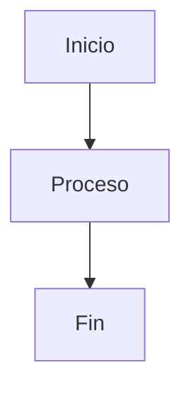
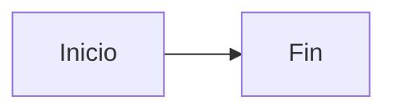
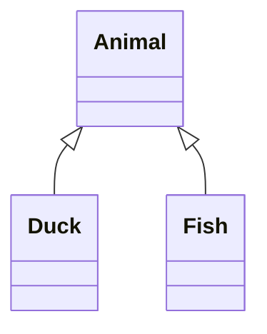
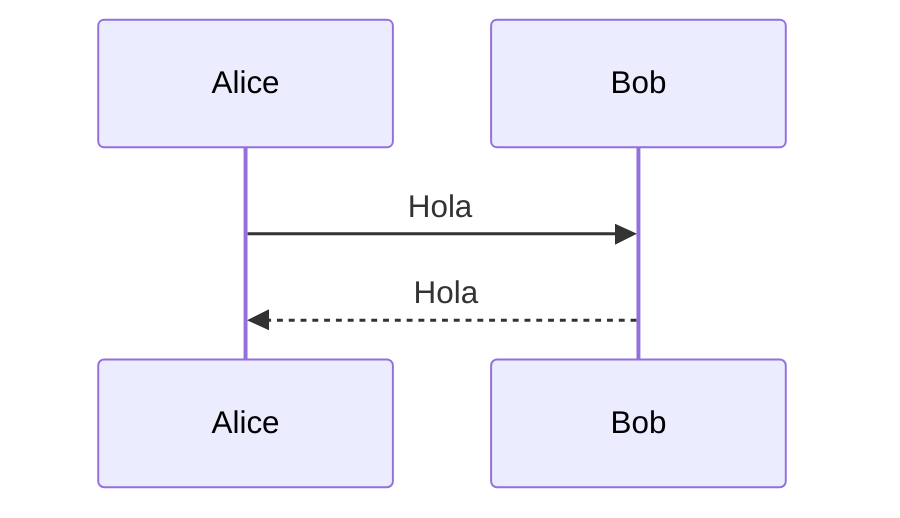
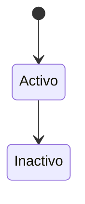

# TURTLE Diagrams

Repositorio de diagramas para el proyecto TURTLE, generados con [Mermaid](https://mermaid.js.org/) y [PlantUML](https://plantuml.com/), desplegados automaticamente via [GitHub Pages](https://turtle-urp.github.io/TURTLE-DIAGRAMS).

## Estructura del proyecto

```
turtle-diagrams/
├── diagrams/                  # Fuentes .mmd (Mermaid) y .puml (PlantUML)
│   ├── arquitecture-diagrams/
│   ├── class-diagrams/
│   ├── EER-diagrams/
│   ├── sequence-diagrams/
│   ├── state-diagrams/
│   ├── use-case-diagrams/
│   └── example.mmd
├── public/
│   ├── svgs/                  # SVGs generados (desplegados en Pages)
│   └── images/                # PNGs generados
├── scripts/
│   ├── build-diagrams.sh      # Orquestador (extensible por formato)
│   ├── lib/common.sh
│   └── renderers/             # Un renderer por extension (mmd, puml, ...)
├── tools/                     # plantuml.jar local (no versionado)
├── puppeteer-config.json      # Config para CI (--no-sandbox)
├── .github/workflows/
│   └── deploy.yml             # Workflow de GitHub Actions
└── package.json
```

## Requisitos previos

- [Node.js](https://nodejs.org/) >= 18
- npm (viene con Node.js)
- JDK 17+ (`java` en PATH) — solo para diagramas PlantUML
- [Graphviz](https://graphviz.org/) (`dot` en PATH) — solo para diagramas PlantUML
- PlantUML JAR en `tools/plantuml.jar`, o variable `PLANTUML_JAR`

Descargar el JAR (ejemplo, version pinneada en CI):

```bash
mkdir -p tools
curl -fsSL -o tools/plantuml.jar \
  "https://github.com/plantuml/plantuml/releases/download/v1.2026.6/plantuml-1.2026.6.jar"
```

## Agregar un diagrama

### Mermaid (`.mmd`)

1. Crear un archivo `.mmd` en la carpeta correspondiente dentro de `diagrams/`:

```bash
# Linux / macOS
touch diagrams/arquitecture-diagrams/mi-diagrama.mmd

# Windows (PowerShell)
New-Item -ItemType File -Path "diagrams\arquitecture-diagrams\mi-diagrama.mmd"
```

2. Escribir el diagrama en sintaxis Mermaid:



3. Hacer push a `main`. El workflow lo convertira automaticamente a SVG y PNG.

### PlantUML (`.puml`)

1. Crear un archivo `.puml` (por ejemplo bajo `diagrams/use-case-diagrams/`).
2. Escribir el diagrama con `@startuml` / `@enduml`.
3. Push a `main`; el build genera SVG y PNG en las mismas rutas publicas.

## Build local

### Linux / macOS

```bash
npm install
npm run build:diagrams
```

### Windows (PowerShell)

```powershell
npm install
npm run build:diagrams
```

> **Nota:** En Windows se puede ejecutar bash directamente si tienes Git Bash instalado (viene incluido con [Git for Windows](https://git-scm.com/download/win)). Tambien puedes usar WSL.

O ejecutar un diagrama Mermaid individual:

```bash
# SVG
npx mmdc -i diagrams/example.mmd -o public/svgs/example.svg

# PNG (alta calidad, escala 4x)
npx mmdc -i diagrams/example.mmd -o public/images/example.png -s 4 -b white
```

## Extender el build a otro formato

1. Anadir la extension a `EXTENSIONS` en `scripts/build-diagrams.sh`.
2. Crear `scripts/renderers/<ext>.sh` exportando `render_<ext> <input> <svg_out> <png_out>`.
3. Instalar las dependencias necesarias en local y en `.github/workflows/deploy.yml`.

## URLs de los diagramas

Los SVGs y PNGs se sirven desde GitHub Pages:

### SVGs
```
https://turtle-urp.github.io/TURTLE-DIAGRAMS/svgs/<carpeta>/<nombre>.svg
```

Ejemplo:
```
https://turtle-urp.github.io/TURTLE-DIAGRAMS/svgs/arquitecture-diagrams/example.svg
https://turtle-urp.github.io/TURTLE-DIAGRAMS/svgs/class-diagrams/example.svg
https://turtle-urp.github.io/TURTLE-DIAGRAMS/svgs/EER-diagrams/anidado/example.svg
https://turtle-urp.github.io/TURTLE-DIAGRAMS/svgs/use-case-diagrams/cus04-emitir-orden-de-abastecimiento.svg
```

### PNGs (alta calidad)
```
https://turtle-urp.github.io/TURTLE-DIAGRAMS/images/<carpeta>/<nombre>.png
```

Ejemplo:
```
https://turtle-urp.github.io/TURTLE-DIAGRAMS/images/arquitecture-diagrams/example.png
https://turtle-urp.github.io/TURTLE-DIAGRAMS/images/class-diagrams/example.png
https://turtle-urp.github.io/TURTLE-DIAGRAMS/images/use-case-diagrams/cus04-emitir-orden-de-abastecimiento.png
```

## Tipos de diagramas soportados

### Mermaid

Mermaid soporta multiples tipos de diagramas. Ejemplos:

**Flowchart:**


**Class diagram:**


**Sequence diagram:**


**State diagram:**


Documentacion completa: https://mermaid.js.org/intro/

### PlantUML

Use cases, class, sequence, component, etc. Documentacion: https://plantuml.com/

## Tecnologias

- [Mermaid CLI](https://github.com/mermaid-js/mermaid-cli) v11.16 - Conversion de .mmd a SVG y PNG
- [PlantUML](https://plantuml.com/) (JAR + Java + Graphviz) - Conversion de .puml a SVG y PNG
- [GitHub Actions](https://docs.github.com/actions) - Build y deploy automatico
- [GitHub Pages](https://pages.github.com/) - Hosting estatico
